# Viewer Profile Generator User Guide

## Introduction

Google Cardboard app ecosystem is growing fast: the Google Play Store contains hundreds of apps compatible with Google Cardboard. The Play Store also contains a [dedicated Cardboard app collection](https://play.google.com/store/apps/collection/promotion_3001011_cardboard_featured_apps), which features the best of these apps.

VR viewers can come in a wide variety of shapes and sizes. Use the viewer
profile generation tool to ensure that Cardboard apps work properly with your
specific viewer. The documentation below describes how to use this tool in
detail, but if you have any questions regarding the viewer profile generator or
this usage guide, please contact [wwgc@google.com](mailto:wwgc@google.com).

## Table of contents
<!-- START doctoc generated TOC please keep comment here to allow auto update -->
<!-- DON'T EDIT THIS SECTION, INSTEAD RE-RUN doctoc TO UPDATE -->

  - [Viewer Profile Generator Usage](#viewer-profile-generator-usage)
    - [Prerequisites](#prerequisites)
    - [Step 1. Viewing the VR scene on your smartphone](#step-1-viewing-the-vr-scene-on-your-smartphone)
    - [Step 2. Company and viewer details](#step-2-company-and-viewer-details)
    - [Step 3. Viewer input parameters](#step-3-viewer-input-parameters)
    - [Step 4. Physical viewer parameters](#step-4-physical-viewer-parameters)
      - [Screen to lens distance](#screen-to-lens-distance)
      - [Inter-lens distance](#inter-lens-distance)
      - [Screen vertical alignment](#screen-vertical-alignment)
      - [Distortion coefficients](#distortion-coefficients)
      - [Advanced viewer parameters](#advanced-viewer-parameters)
    - [Step 4. QR Viewer Profile Generation](#step-4-qr-viewer-profile-generation)
  - [Feedback](#feedback)

<!-- END doctoc generated TOC please keep comment here to allow auto update -->

## Viewer Profile Generator Usage

### Prerequisites

In order to create a viewer profile successfully, you will need a suitable
smartphone for viewing the lens calibration VR scene. The recommended phones
for viewing this VR scene are Samsung Galaxy S5 (Android) and Apple iPhone 6
Plus (iOS).

If you are using a different smartphone, here are the minimal requirements for
the smartphone.

  1. The  smartphone should be able to render the scene in full screen. To that end,
  you should use an Android smartphone which does not have the physical
  navigation keys. This will ensure that the software navigation keys like back
  or home buttons are not visible when viewing the VR scene:

  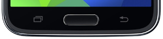
  
  _Physical navigation keys on Samsung Galaxy S5_

  If you do not have access to an Android phone with the physical navigation
  keys, download and install the [GMD Full Screen Immersive Mode](https://play.google.com/store/apps/details?id=com.gmd.immersive) app which can temporarily hide the software navigation buttons.

  
  
  _Software navigation keys hidden using the GMD Full Screen Immersive Mode._

  2. The smartphone screen should be bigger than the total visible screen area (i.e.
bigger than the smartphone screen facing apertures) on your viewer.

    * This phone’s screen is NOT large enough for viewer profile creation:
    
      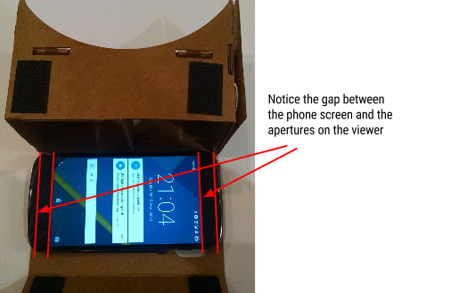

    * This phone has a large enough screen for viewer profile creation:
    
      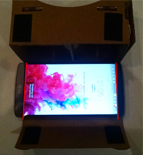

### Step 1. Viewing the VR scene on your smartphone

Open the [viewer profile generator](https://voyg0eji.firebaseapp.com/) on your desktop browser and scan the QR code using a smartphone:

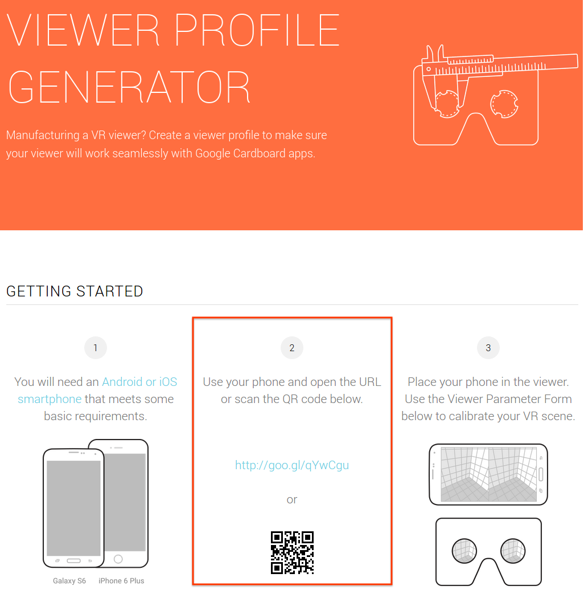

When the scene opens on your phone, tap the screen once to show it in full
screen. If you see a popup that says "Mobile device display properties
unknown", then the phone cannot be used for calibration because the physical
screen size info is unavailable.

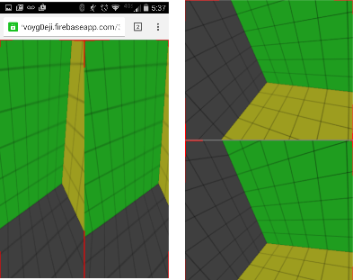
_Calibration VR scene on the smartphone_

After opening the VR scene on your smartphone, insert the smartphone into your
viewer and proceed with entering the details of your viewer into your browser as described below.

### Step 2. Company and viewer details

Start by entering the company and viewer names:

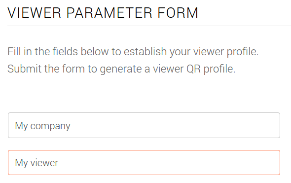

These names will be visible to the users during the viewer "pairing" and other
flows in Google Cardboard-compatible apps.

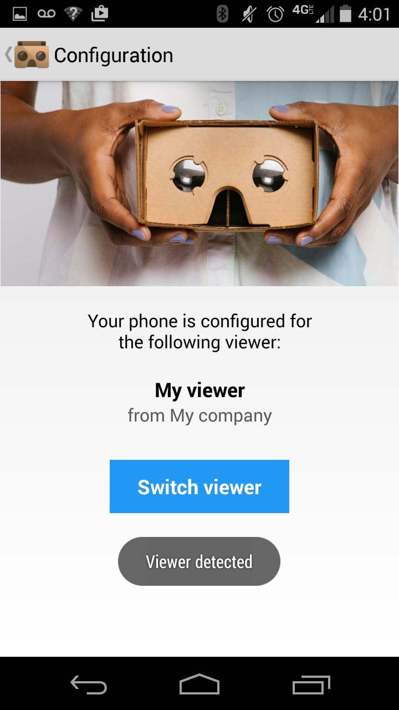

### Step 3. Viewer input parameters

After entering the company and viewer names, describe the inputs on your
viewer. In particular, describe the primary button on your device:

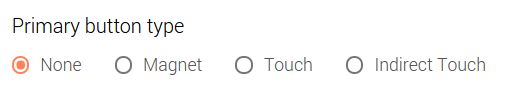

  * If your device has no inputs and the smartphone screen is not accessible,
choose "NONE". Similarly, choose "NONE" if your device has a separate Bluetooth
controller and no other built-in inputs.
  * If your device has no inputs, but the user can touch the smartphone screen with
the finger without taking the phone out of the viewer, choose "TOUCH".
  * If your device has a mechanical input which is ultimately registered as a
screen touch, but the user's finger is not touching the screen directly, choose
"INDIRECT\_TOUCH".
  * If your device has a Google Cardboard-like magnetic input, choose "MAGNET".

### Step 4. Physical viewer parameters

After describing the inputs above, you will need to describe the physical
viewer parameters so that the phones can render VR viewports at the correct
positions on the screen. Check your parameters for correctness using the lens
calibration VR scene that is currently open on your smartphone.

#### Screen to lens distance

Measure the distance between the smartphone screen and the lenses of your
viewer using a ruler or a caliper as shown in the diagram below, and enter the
distance in millimeters into the "Screen to lens distance (mm)" field.

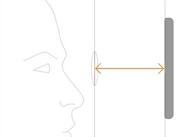 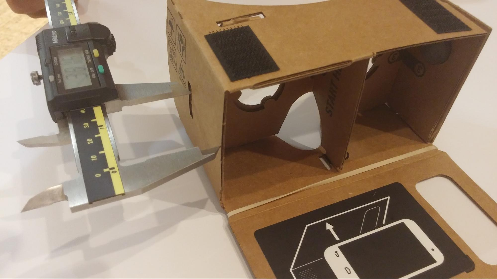

If your viewer comes with an adjustable focal distance, measure the average
distance between the screen and the lenses.

<em><strong>Tip: </strong>You can use the "arrow up" and "arrow down" keys on your keyboard to fine tune
any numerical values in the form. </em>

#### Inter-lens distance

Measure the distance between the centers of your viewer's lenses using a ruler
or a caliper as shown in the diagram below, and enter this distance in
millimeters into the "Inter-lens distance (mm)" field.

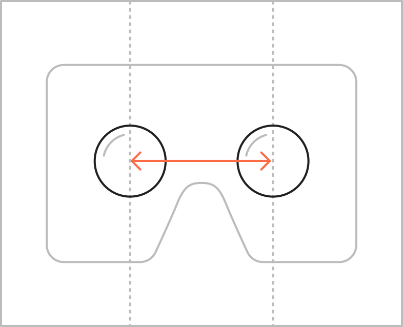 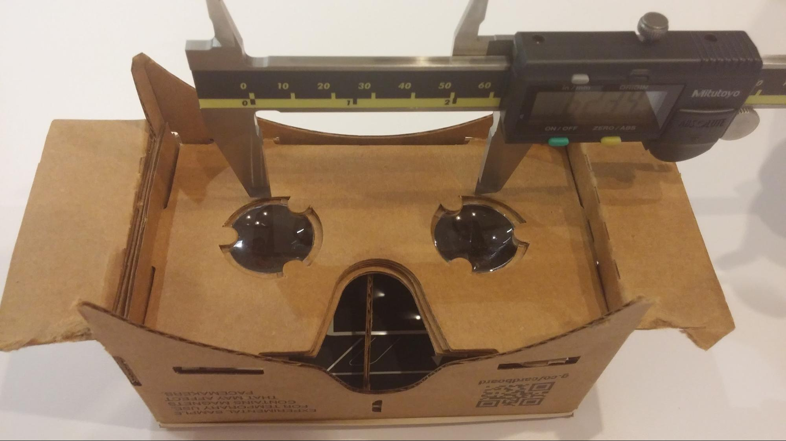

If your viewer comes with an adjustable inter-lens distance to accommodate
varying IPDs, measure the average distance between the screen and the lenses.

After measuring and entering the inter-lens distance into the viewer profile
form, ensure that your eyes can clearly converge on red lens center markers in
the scene. Here are a couple of criteria that can help you to determine whether
the inter-lens distance is entered correctly:

  * <strong>Correct inter-lens distance</strong>: when viewed in your VR headset, the red lens center markers appear sharp and
clear. Your eyes are are able to converge on the lens center markers in a
relaxed state, and you do not feel eye strain when converging on the markers.

  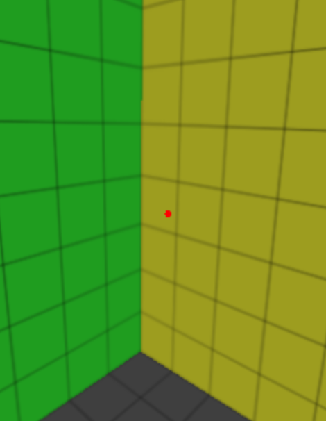

  The inter-lens distance should also be equal to the distance between the lens
center markers when measured with a ruler or a caliper.

  

  * <strong>Incorrect inter-lens distance</strong>: When viewing in your VR headset, the lens center markers might appear blurry
or duplicated. In extreme cases, you might be seeing two separate lens separate
markers instead of one.

  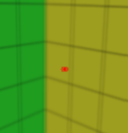 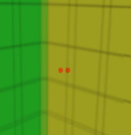

  If this is the case, re-measure the inter-lens
distance on your physical viewer and readjust the values in the "Inter-lens
distance" field.

#### Screen vertical alignment

Choose whether the smartphone screen is aligned to the bottom or to the top of
your viewer when the smartphone is inserted, or whether the smartphone is
always vertically centered with respect to lenses.

Here are the more detailed explanations for different screen vertical alignment
options.

  * "BOTTOM": choose this option if a smartphone is always aligned with the bottom
plane of your viewer when fully inserted, or if the viewer attaches to the
bottom of the phone.

  

  This option applies for most viewers, including the original Google Cardboard.

  * "TOP": choose this option if the smartphone is aligned with the top plane of
your viewer when fully inserted, or if the viewer attaches to the top of the
phone.

  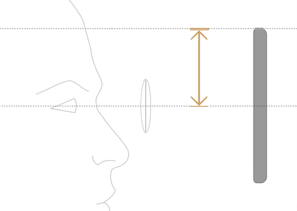

  * "CENTER": choose this option if the center of the smartphone screen is always
vertically aligned with the center of the lenses in your viewer.

If you chose "BOTTOM" or "TOP" options for "Screen vertical alignment", measure
the tray to lens-center distance from the bottom/top of your viewer planes
respectively and enter it into the "Tray to lens-center distance (mm)" field.

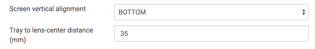

To ensure that you have entered the screen vertical distance correctly, verify
that the red markers appear in the vertical center of the visible
field-of-view, when viewed through your VR headset.

Here are a couple of criteria that can help you to determine whether the tray
to lens-center distance is entered correctly:

  * <strong>Correct tray to lens-center distance</strong>: when viewed in your VR headset, the red lens center marker appears vertically
centered. (Verify this by viewing the scene with both eyes, and then closing
one eye at a time).

  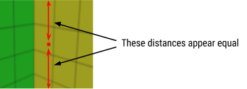

  * <strong>Incorrect tray to lens-center distance</strong>: when viewing in your VR headset, the lens center markers appear not centered
vertically.

  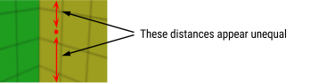

 If this is the case, re-measure the tray to lens-center distance
on your physical viewer, and make sure that you have chosen a correct "Screen
vertical alignment" option.

#### Distortion coefficients

Google Cardboard SDKs for Unity and Android can automatically correct for the [radial lens distortion](http://en.wikipedia.org/wiki/Distortion_%28optics%29). The typical lenses used for mobile VR headsets exhibit pincushion distortion,
as illustrated below:

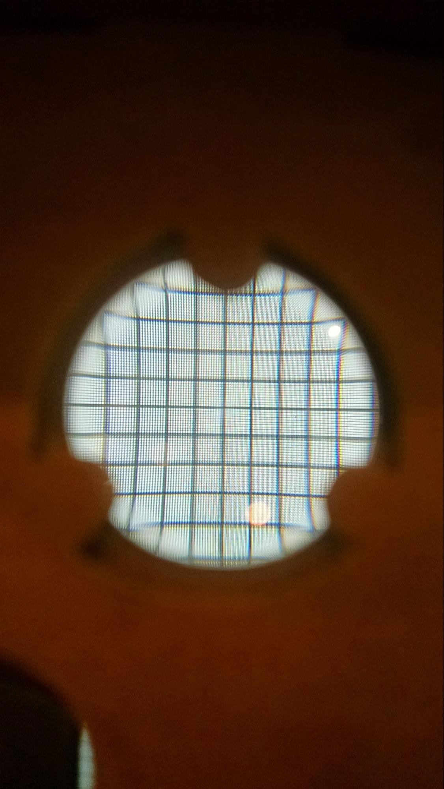 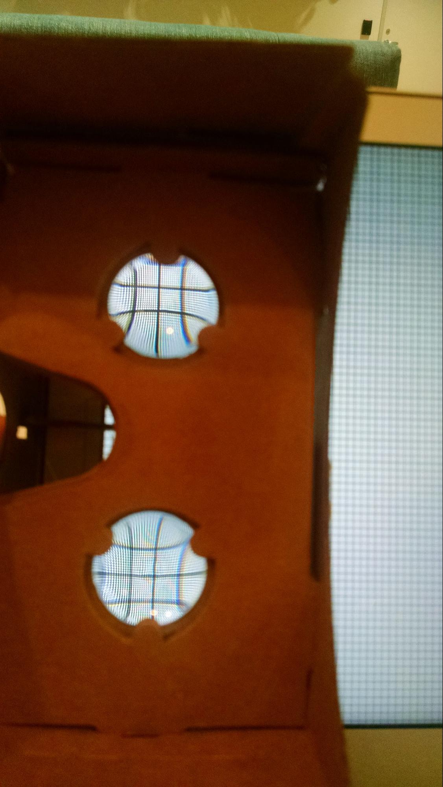

This type of radial distortion can be corrected using Brown's distortion model:

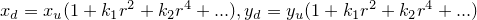

where 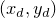 is the distorted image point, 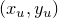 is the undistorted image point,  is the distortion center (principal point), 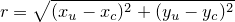
and  is the  distortion coefficient.

Google Cardboard SDKs approximate the ideal distortion model by exposing  and
 coefficients.

If you know your lens distortion  and  coefficients, insert them into the "Distortion coefficients" field.

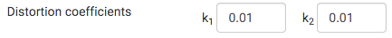

To <strong>empirically</strong> establish these coefficients or to double-check that the coefficients which
you have entered are correct, open the VR scene on your smartphone as described
above and insert it into your viewer. Adjust the coefficients until the scene
looks correct as described below.

If the coefficients are correct, the straight lines in the virtual world should
still appear straight when you are looking at them through the lenses.
Similarly, right (90°) angles should still appear as right angles when looking
at them through the lenses. These conditions should hold both in the center of
your field-of-view and in the periphery.

Here are a couple of criteria that can help you to determine whether the lens
distortion coefficients are entered correctly:

  * <strong>Correct coefficients</strong>: when viewed in your VR headset, all angles appear to be 90° and all the lines
are straight.

  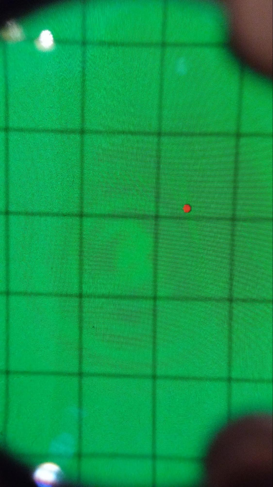 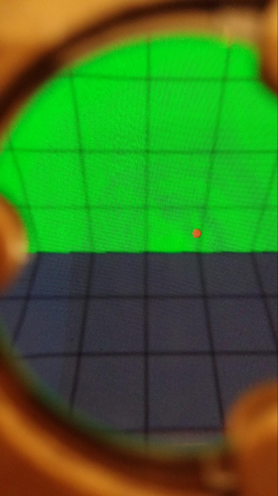

  * <strong>Incorrect coefficients</strong>: lines do not appear straight or angles do not appear right at some parts of
the field of view when viewing the scene in the VR headset.

  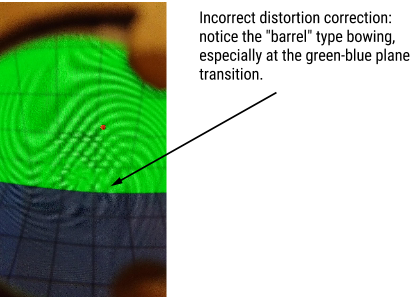
  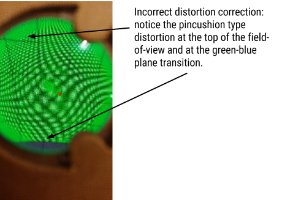

#### Advanced viewer parameters

To configure the advanced viewer parameters, select the checkbox "Advanced
viewer parameters" at the top right corner of "Viewer parameters" form.

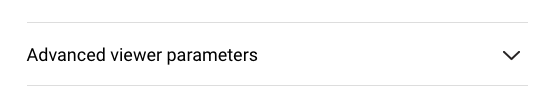

Within the advanced viewer parameters, you can configure the field-of-view for
your left lens. However, changing the field-of-view angles results only in a
slight rendering optimization on large screen-size smartphones. For most
viewers these fields should be set to 50° or more.

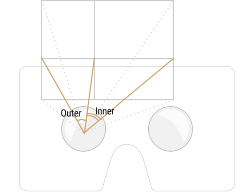
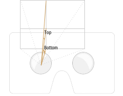

Also, within the advanced viewer parameters you can configure whether your
viewer contains some embedded magnets. Selecting the magnet checkbox will
inform all apps built using the Cardboard SDKs that the smartphone's
magnetometer should not be used.

### Step 4. QR Viewer Profile Generation

After performing the steps above, click on the "Generated profile >" button.
The next page contains a generated viewer profile which you can test with
Cardboard-compatible applications.

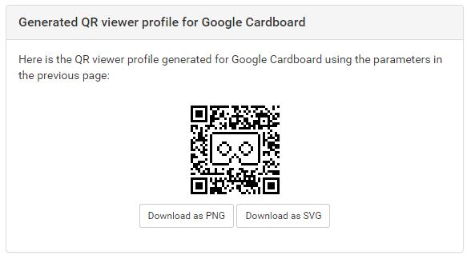

Open the Google Cardboard app, select "Configuration" menu option, click on
"Switch viewer" and scan the generated QR code.

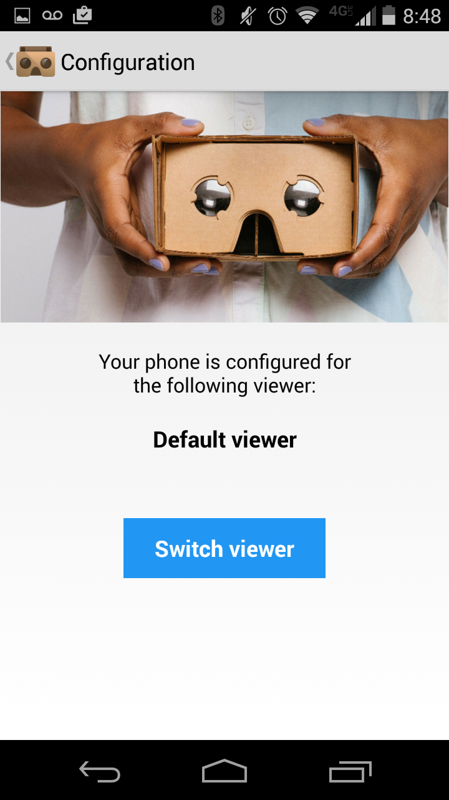

If the profile generation went well, all of the Google Cardboard apps should
now be adapted to work perfectly in your new VR viewer!

Before you close the tool, copy and paste the viewer profile URI (starts with <em>http://google.com/cardboard/cfg?p=...) </em>from the "Save or load viewer parameters" section to somewhere safe.

The viewer profile generator will persist the viewer profiles between the
sessions, but the URI can be shared between your teammates and across multiple
machines.

## Feedback

If you encounter any bugs in the tool or have suggestions for improvements,
drop us a line at [wwgc@google.com](mailto:wwgc@google.com).
