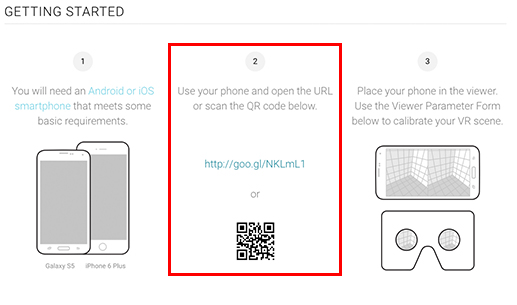
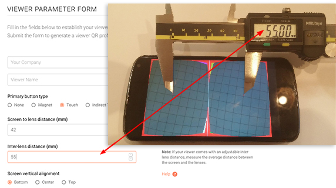
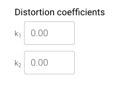

Viewer Profile Generator User Guide
===================================

### How To Get Started

###### Introduction

The Google Cardboard app ecosystem is growing fast. The Google Play Store contains hundreds of apps compatible with Google Cardboard and a [dedicated Cardboard app collection](https://play.google.com/store/apps/collection/promotion_3001011_cardboard_featured_apps) which features the best of these apps.

Virtual reality (VR) viewers come in a wide variety of shapes and sizes. Generate a viewer profile to make sure Cardboard apps work properly with your specific viewer. All the information you’ll need to use the viewer profile generator is below.

Send additional questions to [wwgc@google.com](mailto:wwgc@google.com).

*What you’ll find in this document:*

* <strong>[Getting Started](#getting-started)</strong>
  * [Prerequisites](#prerequisites)
  * [Viewing the VR Scene on Your Smartphone](#viewing-the-vr-scene-on-your-smartphone)
* <strong>[Viewer Parameter Form](#viewer-parameter-form)</strong>
  * [Company and Viewer Details](#company-and-viewer-details)
  * [Primary Button Parameters](#primary-button-parameters)
  * [Physical Viewer Parameters](#physical-viewer-parameters)
  * [Screen to Lens Distance](#screen-to-lens-distance-mm-field)
  * [Inter-lens Distance](#inter-lens-distance-mm-field)
  * [Screen Vertical Alignment](#screen-vertical-alignment)
  * [Tray to Lens Center Distance](#tray-to-lens-center-distance-mm-field)
  * [Distortion Coefficients](#distortion-coefficients)
  * [Advanced Viewer Parameters](#advanced-viewer-parameters)
* <strong>[QR Viewer Profile Generation](#qr-viewer-profile-generation)</strong>
* <strong>[Share Your Feedback](#feedback)</strong>

### Getting Started

###### Prerequisites
In order to create a viewer profile, you will need a smartphone that is equipped for viewing the lens calibration VR scene. We recommend using the Samsung Galaxy S5 (Android) and the Apple iPhone 6 Plus (iOS).

If you are using a different smartphone, it will need to meet these requirements:

*The smartphone should be able to render the scene in full screen.* You should use an Android smartphone which does not have the physical navigation keys. This will ensure that the software navigation keys (like “back” or “home” buttons) are not visible when viewing the VR scene.

_Physical navigation keys on Samsung Galaxy S5_

If you do not have access to an Android smartphone with the physical navigation keys, download and install the [GMD Full Screen Immersive Mode](https://play.google.com/store/apps/details?id=com.gmd.immersive) app which enables you to hide the software navigation buttons temporarily.

Here’s how to hide software navigation buttons on an Android smartphone:

_Software navigation keys hidden using the GMD Full Screen Immersive Mode._

*The smartphone screen should be bigger than your viewer’s total visible screen area*, i.e. bigger than the smartphone screen facing apertures.

If your phone’s screen is not large enough for viewer profile creation it may look like this:

A phone with a screen large enough for viewer profile creation looks like this:

###### Viewing the VR Scene on Your Smartphone

Open the [viewer profile generator](https://voyg0eji.firebaseapp.com/) on your desktop browser and use a smartphone to scan the QR code:

When the calibration VR scene opens on your phone, tap the screen once to switch to full screen.

If you see this message—”Mobile device display properties unknown”–your phone cannot be used for calibration because the physical screen size information is unavailable.

_Calibration VR scene on the smartphone_

After you open the VR scene, place the phone into your viewer. Now you can make adjustments using the Viewer Parameter Form.

### Viewer Parameter Form

###### Company and Viewer Details

Fill in the fields to describe your viewer, then generate a viewer profile to make sure it works seamlessly with your specific viewer.

Start by entering your company and viewer names. These names will be visible to users.

###### Primary Button Parameters
Next, describe the primary button on your device.

Choose <strong>None</strong> if:
- Your device has no inputs and the smartphone screen is not accessible.
- Your device has a separate Bluetooth controller and no other built-in inputs.

Choose <strong>Magnet</strong> if your device has a Google Cardboard-like magnetic input. This will inform all apps built using the Cardboard SDKs that the smartphone's magnetometer should not be used.

Choose <strong>Touch</strong> if your device has no inputs, but the user can touch the smartphone screen with his/her finger without taking the phone out of the viewer.

Choose <strong>Indirect Touch</strong> if your device has a mechanical input which is ultimately registered as a screen touch, but the user's finger is not touching the screen directly.

###### Physical Viewer Parameters

After you determine the primary button type, describe the physical viewer parameters so that phones can render VR viewports at the correct positions on screens. Confirm parameter accuracy using the lens calibration VR scene that is open on your smartphone.

*TIP*: The VR scene is synced to the Viewer Parameter Form. You can adjust the parameters using your keyboard while the viewer is held up to your head.

Use the “tab” key to jump between fields.

Use the up and down keyboard arrows to increase or decrease values within the fields.

###### Screen to Lens Distance (mm) Field

Use a ruler or caliper as shown in the diagram below to measure the distance between the smartphone screen and the lenses of your viewer. Enter the distance in millimeters (mm).

 

If your viewer comes with an adjustable focal distance, measure the average distance between the screen and the lenses.

###### Inter-lens Distance (mm) Field

Using a ruler or a caliper as shown in the diagram below, measure the distance between the centers of your viewer's lenses. Enter this distance in millimeters (mm).

 

If your viewer comes with an adjustable inter-lens distance to accommodate varying IPDs, measure the average distance between the screen and the lenses.

After measuring and entering the inter-lens distance into the viewer profile form, make sure your eyes can clearly converge on the red lens center markers in the scene.

*If your inter-lens distance is CORRECT:*
- When viewed in your VR headset, the red lens center markers appear sharp and clear.
- Your eyes are are able to converge on the lens center markers in a relaxed state.
- You do not feel eye strain when converging on the markers.

The inter-lens distance should also be equal to the distance between the lens center markers when measured with a ruler or a caliper.

*If your inter-lens distance in INCORRECT:*

 

To correct your inter-lens distance, re-measure the inter-lens distance on your physical viewer and then input the corrected values in the "Inter-lens distance (mm)" field.

###### Screen Vertical Alignment

Indicate if the smartphone screen is aligned to the top, bottom or center of your viewer when the smartphone is inserted.

Choose <strong>Bottom</strong> if the smartphone–when fully inserted–is always aligned with the bottom plane of your viewer, or if the viewer attaches to the bottom of the phone. This option applies for most viewers, including the original Google Cardboard.

Choose <strong>Top</strong> if the smartphone–when fully inserted–is aligned with the top plane of your viewer, or if the viewer attaches to the top of the phone.

Choose <strong>Center</strong> if the center of the smartphone screen is always vertically aligned with the center of the lenses in your viewer.

###### Tray to Lens-center Distance (mm) Field

If you choose <strong>Bottom</strong> or <strong>Top</strong>, measure the tray to lens-center distance from the top or bottom of your viewer planes respectively and enter it into the "Tray to lens-center distance (mm)" field.

_What you're measuring when you choose <strong>Top</strong>_

_What you're measuring when you choose <strong>Bottom</strong>_

Use your VR headset to ensure that you have entered the screen vertical distance correctly. Check to see if the red markers appear in the vertical center of the visible field-of-view.

*If your tray to lens-center distance is CORRECT* the red lens center marker appears vertically centered when viewed in your VR headset. Confirm this by viewing the scene with both eyes, and then closing one eye at a time.

If your tray to lens-center distance is INCORRECT the lens center markers appear not vertically centered when viewed in your VR headset.

To correct your lens-center distance, measure the tray to lens-center distance on your physical viewer again, and make sure that you have chosen the correct "Screen Vertical Alignment" option.

###### Distortion Coefficients

Google Cardboard SDKs for Unity and Android are able to automatically correct for the [radial lens distortion](http://en.wikipedia.org/wiki/Distortion_%28optics%29). The typical lenses used for mobile VR headsets exhibit pincushion distortion. See illustrations below.

 

This type of radial distortion can be corrected using Brown's distortion model:

where  is the distorted image point,  is the undistorted image point,  is the distortion center (principal point), 
and  is the  distortion coefficient.

Google Cardboard SDKs approximate the ideal distortion model by exposing  and
 coefficients.

If you know your lens distortion  and  coefficients, insert them into the "Distortion coefficients" field.

You can also _empirically_ establish these coefficients or double-check the coefficients you have entered are correct. Open the VR scene on your smartphone as described above and insert it into your viewer. Adjust the coefficients in the Viewer Parameter Form until the scene looks correct.

*If the coefficients are CORRECT* the conditions below should hold in the center of your field-of-view and in the periphery:

- Straight lines in the virtual world should still appear straight when you are looking at them through the lenses.
- Right (90 degree) angles should still appear as right angles when looking at them through the lenses.

 

*If coefficients are INCORRECT* some lines will not appear straight or some angles will not appear right in the field-of-view when viewing the scene in the VR headset.

  

###### Advanced Viewer Parameters

To configure the advanced viewer parameters, open the "Advanced viewer parameters" area at the bottom of "Viewer Parameters" form.

Within the advanced viewer parameters, you can configure the field-of-view for your left lens. However, changing the field-of-view angles will result in only a slight rendering optimization on large screen-size smartphones. For most viewers these fields should be set to 50 degrees or more.

### QR Viewer Profile Generation

After performing the steps above, click on the "Generate Profile” button. This will open a page that contains a generated viewer profile that you can test with Cardboard-compatible applications.

1. Now, open the Google Cardboard app.
2. Select "Settings" from the menu.
3. Click on "Switch viewer".
4. Scan the generated QR code.

*If your profile generation was a success*, all of the Google Cardboard apps should now be adapted to work perfectly in your new VR viewer!

*If your profile generation was not successful*, go back to the Viewer Parameters Form to adjust your data inputs and try again.

Before you close the tool, copy and paste the viewer profile URI (starts with `http://google.com/cardboard/cfg?p=...`) from the "Save or load viewer parameters" section. Save this URI for reference later.

### Feedback

If you encounter bugs in the tool or have suggestions for improvements, please drop us a line at [wwgc@google.com](mailto:wwgc@google.com).
